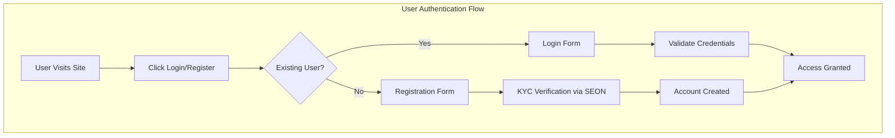

[<< Back](./../design.md)

# Use Cases - Gaming Marketplace Platform
Below we elaborate on the system's use cases for a comprehensive gaming marketplace platform that competes with existing solutions.

We follow the iDesign principles as highlighted in the [design.md](./../design.md) file in this repository.

## System Requirements
*High-level system requirements that drive these use cases for the gaming marketplace*

### Functional Requirements
- **FR-001**: User registration and authentication system with KYC integration
- **FR-002**: Marketplace product catalog with categorized gaming services
- **FR-003**: Featured product carousel with customizable selections
- **FR-004**: SmartICO.ai plugin integration for gamification features
- **FR-005**: SEON fraud protection and KYC verification system
- **FR-006**: Online iGaming server management and integration
- **FR-007**: Game tournament creation and management system
- **FR-008**: Virtual pit boss functionality for in-game assistance
- **FR-009**: Free games catalog and access management
- **FR-010**: Jackpot games system with real-time updates
- **FR-011**: Random prize distribution system
- **FR-012**: Responsive design for mobile and desktop platforms
- **FR-013**: Dark/light theme switching functionality
- **FR-014**: Customizable header and branding system

### Non-Functional Requirements
- **NFR-001**: Performance - Page load times under 3 seconds
- **NFR-002**: Security - GDPR compliance and data protection
- **NFR-003**: Scalability - Support for 10,000+ concurrent users
- **NFR-004**: Usability - Intuitive navigation and mobile-first design
- **NFR-005**: Reliability - 99.9% uptime availability
- **NFR-006**: Responsiveness - Mobile, tablet, and desktop compatibility

## Actors
*Define the different types of users/systems that interact with the marketplace*

- **Primary Actors**: 
  - End Users (players, gamers)
  - Service Providers (offering gaming services)
  - Tournament Organizers
- **Secondary Actors**: 
  - SmartICO.ai API
  - SEON Fraud Protection Service
  - iGaming Server Providers
  - Payment Processors
- **Administrative Actors**: 
  - Platform Administrators
  - Customer Support Staff
  - Compliance Officers

## Use Case Diagrams

### High-Level System Overview

```mermaid
graph TB
    User[End User] --> UC1[Browse Marketplace]
    User --> UC2[User Registration/Login]
    User --> UC3[Purchase Services]
    User --> UC4[Join Tournaments]
    User --> UC5[Play Free Games]
    User --> UC6[Claim Random Prizes]
    
    Provider[Service Provider] --> UC7[List Services]
    Provider --> UC8[Manage Offerings]
    
    Admin[Administrator] --> UC9[Manage Platform]
    Admin --> UC10[Configure Features]
    
    SmartICO[SmartICO.ai] --> UC11[Gamification Plugins]
    SEON[SEON] --> UC12[Fraud Protection]
    Gaming[iGaming Servers] --> UC13[Game Hosting]
```

### Detailed Use Case Flows

## Core Use Cases

### UC-001: Browse Marketplace Products

- **Actor**: End User
- **Goal**: Discover and explore available gaming services and products
- **Preconditions**: User has accessed the marketplace platform
- **Main Flow**:
  1. User navigates to the marketplace homepage
  2. System displays categorized product tiles with visual assets
  3. User can filter by categories (SmartICO plugins, SEON services, iGaming servers, etc.)
  4. User can view featured items in the carousel
  5. User can switch between dark/light themes
  6. User can access detailed product information
- **Success Criteria**: User can easily navigate and find relevant products
- **Test Requirements**: Playwright test for responsive design and theme switching

### UC-002: User Registration and Authentication

- **Actor**: End User
- **Goal**: Create account and access personalized features
- **Preconditions**: User is on the platform
- **Main Flow**:
  1. User clicks Register button in header
  2. System presents registration form
  3. User provides required information
  4. System initiates SEON KYC verification
  5. Upon successful verification, account is created
  6. User can log in with credentials
- **Success Criteria**: Secure account creation with fraud protection
- **Test Requirements**: End-to-end authentication flow testing

### UC-003: Purchase Gaming Services

- **Actor**: End User
- **Goal**: Acquire gaming services or products from the marketplace
- **Preconditions**: User is authenticated
- **Main Flow**:
  1. User selects a product from the marketplace
  2. System displays product details and pricing
  3. User clicks purchase/subscribe
  4. System processes payment (future API integration)
  5. User gains access to purchased service
- **Success Criteria**: Smooth purchase experience with proper confirmation
- **Test Requirements**: Mock payment integration testing

### UC-004: Join Game Tournaments

- **Actor**: End User
- **Goal**: Participate in organized gaming tournaments
- **Preconditions**: User is authenticated and has tournament access
- **Main Flow**:
  1. User navigates to tournament section
  2. System displays available tournaments
  3. User selects and joins a tournament
  4. System manages tournament progression
  5. Results are tracked and displayed
- **Success Criteria**: Seamless tournament participation
- **Test Requirements**: Tournament flow and state management testing

### UC-005: Access Free Games

- **Actor**: End User
- **Goal**: Play complimentary games available on the platform
- **Preconditions**: User has platform access
- **Main Flow**:
  1. User navigates to free games section
  2. System displays available free games
  3. User selects and launches a game
  4. Game loads and user can play
- **Success Criteria**: Instant access to free gaming content
- **Test Requirements**: Game loading and playability verification

### UC-006: Claim Random Prizes

- **Actor**: End User
- **Goal**: Participate in random prize distributions
- **Preconditions**: User is authenticated and eligible for prizes
- **Main Flow**:
  1. User navigates to prize section
  2. System displays available prize opportunities
  3. User participates in random draw
  4. System processes and awards prizes
  5. User receives notification of winnings
- **Success Criteria**: Fair and transparent prize distribution
- **Test Requirements**: Prize system integrity testing

### UC-007: Virtual Pit Boss Assistance

- **Actor**: End User
- **Goal**: Receive in-game assistance and guidance
- **Preconditions**: User is engaged in gaming activities
- **Main Flow**:
  1. User requests assistance during gameplay
  2. Virtual pit boss system activates
  3. System provides contextual help and guidance
  4. User receives assistance and continues gaming
- **Success Criteria**: Helpful and responsive assistance system
- **Test Requirements**: AI assistance functionality testing

### UC-008: Jackpot Games Participation

- **Actor**: End User
- **Goal**: Participate in progressive jackpot games
- **Preconditions**: User is authenticated and has game access
- **Main Flow**:
  1. User navigates to jackpot games section
  2. System displays current jackpot amounts
  3. User selects and plays jackpot game
  4. System tracks contributions and potential winnings
  5. System handles jackpot triggers and payouts
- **Success Criteria**: Engaging jackpot gaming experience
- **Test Requirements**: Jackpot mechanics and payout testing

## Use Case Priority Matrix

### High Priority (Must Have)

- **UC-001**: Browse Marketplace Products - Core functionality for product discovery
- **UC-002**: User Registration and Authentication - Essential for personalized experience
- **UC-003**: Purchase Gaming Services - Primary revenue generation
- **UC-005**: Access Free Games - User engagement and platform stickiness

### Medium Priority (Should Have)

- **UC-004**: Join Game Tournaments - Community engagement feature
- **UC-006**: Claim Random Prizes - Gamification element
- **UC-008**: Jackpot Games Participation - Revenue and engagement driver

### Low Priority (Could Have)

- **UC-007**: Virtual Pit Boss Assistance - Advanced AI feature for future enhancement

## Success Metrics

### User Experience Metrics

- **Page Load Time**: < 3 seconds for all marketplace pages
- **Mobile Responsiveness**: 100% functionality across all device types
- **Theme Switching**: Instant visual transition between dark/light modes
- **Search/Filter Performance**: Results displayed within 1 second

### Business Metrics

- **User Registration Rate**: Track conversion from visitor to registered user
- **Service Adoption**: Monitor uptake of different marketplace offerings
- **Revenue Generation**: Track successful transactions and subscriptions
- **User Retention**: Monitor return visits and engagement levels

### Technical Metrics

- **API Response Times**: All service integrations respond within 2 seconds
- **Error Rates**: < 0.1% system errors during normal operations
- **Security Compliance**: 100% compliance with GDPR and gaming regulations
- **Fraud Detection**: Effective SEON integration for user verification

## Traceability Matrix

| Use Case | Requirements | System Components | Test Cases |
|----------|-------------|-------------------|------------|
| UC-001   | FR-002, FR-012, FR-013 | MarketplaceComponent, ThemeProvider | TC-001, TC-002 |
| UC-002   | FR-001, FR-005, NFR-002 | AuthComponent, KYCService | TC-003, TC-004 |
| UC-003   | FR-002, FR-006 | PurchaseComponent, PaymentService | TC-005, TC-006 |
| UC-004   | FR-007 | TournamentComponent, GameService | TC-007, TC-008 |
| UC-005   | FR-009 | FreeGamesComponent, GameService | TC-009, TC-010 |
| UC-006   | FR-011 | PrizeComponent, RandomService | TC-011, TC-012 |
| UC-007   | FR-008 | VirtualPitBossComponent, AIService | TC-013, TC-014 |
| UC-008   | FR-010 | JackpotComponent, GameService | TC-015, TC-016 |

## Acceptance Criteria

### UC-001 Acceptance Criteria

- **Given** a user visits the marketplace homepage
- **When** they view the product catalog
- **Then** they see categorized tiles with visual assets and can filter by service type

### UC-002 Acceptance Criteria

- **Given** a new user wants to register
- **When** they complete the registration form
- **Then** SEON KYC verification is triggered and account is created upon successful verification

### UC-003 Acceptance Criteria

- **Given** an authenticated user selects a service
- **When** they initiate a purchase
- **Then** they are guided through a secure payment process with confirmation

[<< Back](./../design.md)