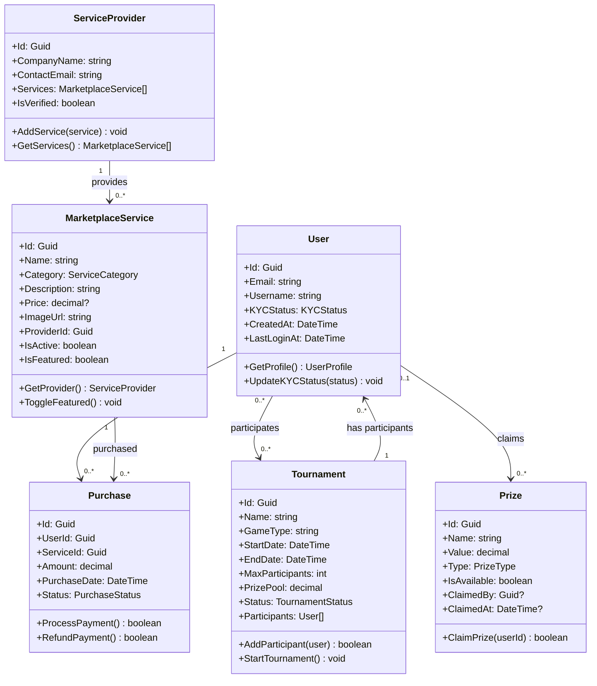
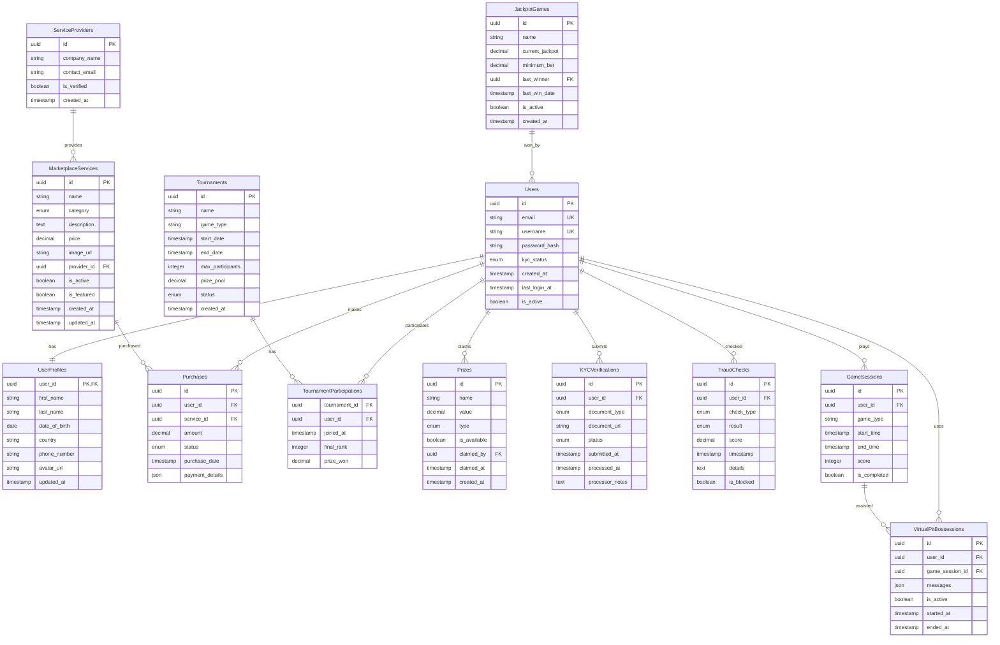

[<< Back](./../design.md)

# Class Diagrams & Architecture - Gaming Marketplace Platform

Below we elaborate on the system's class diagrams and entity relational diagrams for the gaming marketplace platform.

We follow the iDesign principles as highlighted in the [design.md](./../design.md) file in this repository.

## iDesign Architecture Overview

### Architecture Layers

The gaming marketplace follows a 4-layer iDesign architecture:

1. **Manager Layer** (Business Logic & Workflows)
2. **Engine Layer** (Computational & Processing Logic)  
3. **Data Layer** (Data Access & Persistence)
4. **Model Layer** (Domain Entities & DTOs)

## Domain Model Overview

### Core Domain Entities



### Supporting Entities

```mermaid
classDiagram
    %% Authentication and KYC
    class UserProfile {
        +UserId: Guid
        +FirstName: string
        +LastName: string
        +DateOfBirth: DateTime?
        +Country: string
        +PhoneNumber: string
        +AvatarUrl: string?
        +Validate() boolean
    }
    
    class KYCVerification {
        +Id: Guid
        +UserId: Guid
        +DocumentType: DocumentType
        +DocumentUrl: string
        +Status: VerificationStatus
        +SubmittedAt: DateTime
        +ProcessedAt: DateTime?
        +ProcessorNotes: string?
        +Process() VerificationResult
    }
    
    class FraudCheck {
        +Id: Guid
        +UserId: Guid
        +CheckType: FraudCheckType
        +Result: FraudCheckResult
        +Score: decimal
        +Timestamp: DateTime
        +Details: string
        +IsBlocked: boolean
    }
    
    %% Gaming specific entities
    class GameSession {
        +Id: Guid
        +UserId: Guid
        +GameType: string
        +StartTime: DateTime
        +EndTime: DateTime?
        +Score: int?
        +IsCompleted: boolean
        +EndSession(score) void
    }
    
    class JackpotGame {
        +Id: Guid
        +Name: string
        +CurrentJackpot: decimal
        +MinimumBet: decimal
        +LastWinner: Guid?
        +LastWinDate: DateTime?
        +IsActive: boolean
        +ContributeToJackpot(amount) void
        +TriggerWin(userId) JackpotWin
    }
    
    class VirtualPitBossSession {
        +Id: Guid
        +UserId: Guid
        +GameSessionId: Guid
        +Messages: AssistanceMessage[]
        +IsActive: boolean
        +AddMessage(message) void
        +EndSession() void
    }
```



## Manager Layer Classes

### Manager Interfaces

```csharp
public interface IUserManager
{
    Task<UserRegistrationResult> RegisterUserAsync(UserRegistrationRequest request);
    Task<AuthenticationResult> AuthenticateUserAsync(LoginRequest request);
    Task<UserProfile> GetUserProfileAsync(Guid userId);
    Task<bool> UpdateUserProfileAsync(Guid userId, UserProfileUpdateRequest request);
    Task<KYCVerificationResult> InitiateKYCVerificationAsync(Guid userId, KYCRequest request);
}

public interface IMarketplaceManager
{
    Task<MarketplaceService[]> GetServicesAsync(ServiceFilter filter);
    Task<MarketplaceService[]> GetFeaturedServicesAsync(int maxItems = 4);
    Task<MarketplaceService> GetServiceDetailsAsync(Guid serviceId);
    Task<PurchaseResult> PurchaseServiceAsync(Guid userId, Guid serviceId, PurchaseRequest request);
    Task<ServiceCategory[]> GetServiceCategoriesAsync();
}

public interface ITournamentManager
{
    Task<Tournament[]> GetActiveTournamentsAsync();
    Task<TournamentRegistrationResult> RegisterForTournamentAsync(Guid userId, Guid tournamentId);
    Task<Tournament> CreateTournamentAsync(TournamentCreateRequest request);
    Task<TournamentResult> CompleteTournamentAsync(Guid tournamentId, TournamentResults results);
}

public interface IPrizeManager
{
    Task<Prize[]> GetAvailablePrizesAsync();
    Task<PrizeClaimResult> ClaimRandomPrizeAsync(Guid userId);
    Task<PrizeDistributionResult> DistributeRandomPrizesAsync();
    Task<Prize> CreatePrizeAsync(PrizeCreateRequest request);
}

public interface IGamingManager
{
    Task<GameSession> StartGameSessionAsync(Guid userId, string gameType);
    Task<GameSession> EndGameSessionAsync(Guid sessionId, int? score);
    Task<FreeGame[]> GetFreeGamesAsync();
    Task<JackpotGame[]> GetActiveJackpotGamesAsync();
    Task<JackpotContributionResult> ContributeToJackpotAsync(Guid gameId, decimal amount);
}

public interface IVirtualPitBossManager
{
    Task<VirtualPitBossSession> StartAssistanceSessionAsync(Guid userId, Guid gameSessionId);
    Task<AssistanceResponse> GetAssistanceAsync(Guid sessionId, string query);
    Task EndAssistanceSessionAsync(Guid sessionId);
}
```

### Manager Implementations

```csharp
[Manager]
public class UserManager : IUserManager
{
    private readonly IUserEngine _userEngine;
    private readonly IKYCEngine _kycEngine;
    private readonly IFraudEngine _fraudEngine;
    private readonly IUserDataManager _userDataManager;
    
    public UserManager(
        IUserEngine userEngine,
        IKYCEngine kycEngine,
        IFraudEngine fraudEngine,
        IUserDataManager userDataManager)
    {
        _userEngine = userEngine;
        _kycEngine = kycEngine;
        _fraudEngine = fraudEngine;
        _userDataManager = userDataManager;
    }
    
    public async Task<UserRegistrationResult> RegisterUserAsync(UserRegistrationRequest request)
    {
        // Validate request
        var validationResult = _userEngine.ValidateRegistrationRequest(request);
        if (!validationResult.IsValid)
            return UserRegistrationResult.ValidationFailed(validationResult.Errors);
        
        // Check for fraud
        var fraudCheck = await _fraudEngine.CheckRegistrationFraudAsync(request);
        if (fraudCheck.IsBlocked)
            return UserRegistrationResult.FraudDetected(fraudCheck.Reason);
        
        // Create user
        var user = _userEngine.CreateUser(request);
        await _userDataManager.SaveUserAsync(user);
        
        // Initiate KYC if required
        if (request.RequiresKYC)
        {
            await _kycEngine.InitiateKYCProcessAsync(user.Id, request.KYCDocuments);
        }
        
        return UserRegistrationResult.Success(user);
    }
    
    // Additional methods...
}

[Manager]
public class MarketplaceManager : IMarketplaceManager
{
    private readonly IMarketplaceEngine _marketplaceEngine;
    private readonly IPaymentEngine _paymentEngine;
    private readonly IMarketplaceDataManager _dataManager;
    
    public async Task<MarketplaceService[]> GetServicesAsync(ServiceFilter filter)
    {
        var services = await _dataManager.GetServicesAsync(filter);
        return _marketplaceEngine.ApplyBusinessRules(services, filter);
    }
    
    public async Task<PurchaseResult> PurchaseServiceAsync(Guid userId, Guid serviceId, PurchaseRequest request)
    {
        // Validate purchase eligibility
        var eligibility = _marketplaceEngine.ValidatePurchaseEligibility(userId, serviceId);
        if (!eligibility.IsEligible)
            return PurchaseResult.NotEligible(eligibility.Reason);
        
        // Process payment
        var paymentResult = await _paymentEngine.ProcessPaymentAsync(request.PaymentDetails);
        if (!paymentResult.IsSuccessful)
            return PurchaseResult.PaymentFailed(paymentResult.Error);
        
        // Create purchase record
        var purchase = _marketplaceEngine.CreatePurchase(userId, serviceId, request);
        await _dataManager.SavePurchaseAsync(purchase);
        
        return PurchaseResult.Success(purchase);
    }
    
    // Additional methods...
}
```

## Engine Layer Classes

### Engine Interfaces

```csharp
public interface IUserEngine
{
    ValidationResult ValidateRegistrationRequest(UserRegistrationRequest request);
    User CreateUser(UserRegistrationRequest request);
    PasswordValidationResult ValidatePassword(string password);
    AuthenticationResult AuthenticateCredentials(string email, string password, string hashedPassword);
}

public interface IKYCEngine
{
    Task InitiateKYCProcessAsync(Guid userId, KYCDocument[] documents);
    Task<KYCVerificationResult> ProcessKYCDocumentAsync(Guid verificationId);
    KYCStatus DetermineKYCStatus(KYCVerification[] verifications);
}

public interface IFraudEngine
{
    Task<FraudCheckResult> CheckRegistrationFraudAsync(UserRegistrationRequest request);
    Task<FraudCheckResult> CheckTransactionFraudAsync(PurchaseRequest request);
    Task<FraudRiskScore> CalculateRiskScoreAsync(Guid userId, string action);
}

public interface IMarketplaceEngine
{
    MarketplaceService[] ApplyBusinessRules(MarketplaceService[] services, ServiceFilter filter);
    PurchaseEligibility ValidatePurchaseEligibility(Guid userId, Guid serviceId);
    Purchase CreatePurchase(Guid userId, Guid serviceId, PurchaseRequest request);
    MarketplaceService[] DetermineFeaturedServices(MarketplaceService[] allServices, int maxItems);
}

public interface IPaymentEngine
{
    Task<PaymentResult> ProcessPaymentAsync(PaymentDetails paymentDetails);
    Task<RefundResult> ProcessRefundAsync(Guid purchaseId, decimal amount);
    Task<PaymentValidationResult> ValidatePaymentDetailsAsync(PaymentDetails details);
}

public interface IGamingEngine
{
    GameSession CreateGameSession(Guid userId, string gameType);
    GameSessionResult ProcessGameEnd(Guid sessionId, int? score);
    JackpotCalculationResult CalculateJackpotContribution(decimal betAmount, decimal currentJackpot);
    PrizeEligibility DeterminePrizeEligibility(Guid userId);
    Prize SelectRandomPrize(Prize[] availablePrizes);
}

public interface IVirtualPitBossEngine
{
    AssistanceResponse GenerateAssistance(string query, GameContext context);
    ConversationContext UpdateConversationContext(VirtualPitBossSession session, string message);
    AssistanceRecommendation[] GetRecommendations(GameSession gameSession);
}
```

## Data Layer Classes

### Data Manager Interfaces

```csharp
public interface IUserDataManager
{
    Task<User> GetUserByIdAsync(Guid userId);
    Task<User> GetUserByEmailAsync(string email);
    Task SaveUserAsync(User user);
    Task UpdateUserAsync(User user);
    Task<UserProfile> GetUserProfileAsync(Guid userId);
    Task SaveUserProfileAsync(UserProfile profile);
    Task<KYCVerification[]> GetKYCVerificationsAsync(Guid userId);
    Task SaveKYCVerificationAsync(KYCVerification verification);
}

public interface IMarketplaceDataManager
{
    Task<MarketplaceService[]> GetServicesAsync(ServiceFilter filter);
    Task<MarketplaceService> GetServiceByIdAsync(Guid serviceId);
    Task<MarketplaceService[]> GetFeaturedServicesAsync(int maxItems);
    Task SaveServiceAsync(MarketplaceService service);
    Task<Purchase[]> GetUserPurchasesAsync(Guid userId);
    Task SavePurchaseAsync(Purchase purchase);
    Task<ServiceCategory[]> GetServiceCategoriesAsync();
}

public interface ITournamentDataManager
{
    Task<Tournament[]> GetActiveTournamentsAsync();
    Task<Tournament> GetTournamentByIdAsync(Guid tournamentId);
    Task SaveTournamentAsync(Tournament tournament);
    Task<TournamentParticipation[]> GetUserTournamentsAsync(Guid userId);
    Task SaveTournamentParticipationAsync(TournamentParticipation participation);
}

public interface IPrizeDataManager
{
    Task<Prize[]> GetAvailablePrizesAsync();
    Task<Prize> GetPrizeByIdAsync(Guid prizeId);
    Task SavePrizeAsync(Prize prize);
    Task<PrizeClaim[]> GetUserPrizeClaimsAsync(Guid userId);
    Task SavePrizeClaimAsync(PrizeClaim claim);
}

public interface IGamingDataManager
{
    Task<GameSession[]> GetUserGameSessionsAsync(Guid userId);
    Task<GameSession> GetGameSessionByIdAsync(Guid sessionId);
    Task SaveGameSessionAsync(GameSession session);
    Task<JackpotGame[]> GetActiveJackpotGamesAsync();
    Task SaveJackpotGameAsync(JackpotGame game);
    Task<FreeGame[]> GetFreeGamesAsync();
}
```

## Model Layer Classes

### Enumerations

```csharp
public enum ServiceCategory
{
    SmartICOPlugins,
    SEONFraudProtection,
    iGamingServers,
    GameTournaments,
    VirtualPitBoss,
    FreeGames,
    JackpotGames,
    RandomPrizes
}

public enum KYCStatus
{
    NotStarted,
    InProgress,
    Verified,
    Rejected,
    Expired
}

public enum PurchaseStatus
{
    Pending,
    Completed,
    Failed,
    Refunded,
    Cancelled
}

public enum TournamentStatus
{
    Upcoming,
    Registration,
    InProgress,
    Completed,
    Cancelled
}

public enum PrizeType
{
    Cash,
    Credits,
    Service,
    Physical,
    Experience
}

public enum VerificationStatus
{
    Submitted,
    InReview,
    Approved,
    Rejected,
    Expired
}

public enum FraudCheckResult
{
    Clean,
    Suspicious,
    Blocked,
    RequiresReview
}
```

### Data Transfer Objects

```csharp
public record UserRegistrationRequest(
    string Email,
    string Username,
    string Password,
    string FirstName,
    string LastName,
    string Country,
    bool RequiresKYC,
    KYCDocument[]? KYCDocuments
);

public record ServiceFilter(
    ServiceCategory[] Categories,
    decimal? MinPrice,
    decimal? MaxPrice,
    bool? IsFeatured,
    string? SearchTerm
);

public record PurchaseRequest(
    PaymentDetails PaymentDetails,
    string? Notes
);

public record TournamentCreateRequest(
    string Name,
    string GameType,
    DateTime StartDate,
    DateTime EndDate,
    int MaxParticipants,
    decimal PrizePool
);

public record KYCRequest(
    DocumentType DocumentType,
    string DocumentUrl,
    Dictionary<string, string> AdditionalData
);
```

## Database Schema (ERD)



## Integration Points

### External Service Integrations

```csharp
public interface ISmartICOService
{
    Task<PluginConfiguration> GetAvailablePluginsAsync();
    Task<PluginActivationResult> ActivatePluginAsync(Guid userId, string pluginId);
    Task<GamificationData> GetUserGamificationDataAsync(Guid userId);
}

public interface ISEONFraudService
{
    Task<FraudCheckResult> CheckUserAsync(UserFraudCheckRequest request);
    Task<KYCVerificationResult> VerifyDocumentAsync(KYCDocument document);
    Task<RiskScoreResult> CalculateRiskScoreAsync(RiskScoreRequest request);
}

public interface IiGamingServerService
{
    Task<ServerInstance[]> GetAvailableServersAsync();
    Task<ServerProvisionResult> ProvisionServerAsync(ServerProvisionRequest request);
    Task<ServerStatus> GetServerStatusAsync(string serverId);
}

public interface IPaymentProcessorService
{
    Task<PaymentResult> ProcessPaymentAsync(PaymentRequest request);
    Task<RefundResult> ProcessRefundAsync(RefundRequest request);
    Task<PaymentStatus> GetPaymentStatusAsync(string transactionId);
}
```

## Color-Coded Component Classification

### 🟦 Managers (Blue) - Workflow and Business Logic
- UserManager, MarketplaceManager, TournamentManager, PrizeManager, GamingManager, VirtualPitBossManager

### 🟩 Engines (Green) - Computational Logic
- UserEngine, KYCEngine, FraudEngine, MarketplaceEngine, PaymentEngine, GamingEngine, VirtualPitBossEngine

### 🟨 Data Managers (Yellow) - Data Access
- UserDataManager, MarketplaceDataManager, TournamentDataManager, PrizeDataManager, GamingDataManager

### 🟪 Models (Purple) - Domain Entities
- User, MarketplaceService, Tournament, Purchase, Prize, GameSession, JackpotGame

### 🟧 External Services (Orange) - Third-party Integrations
- SmartICOService, SEONFraudService, iGamingServerService, PaymentProcessorService

[<< Back](./../design.md)
