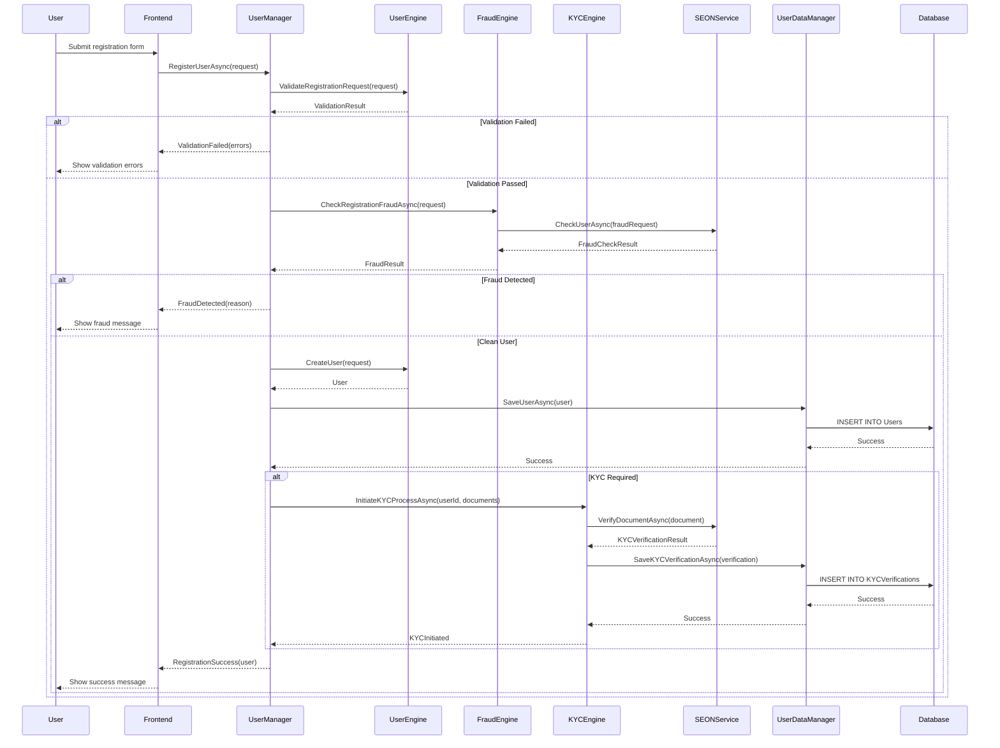
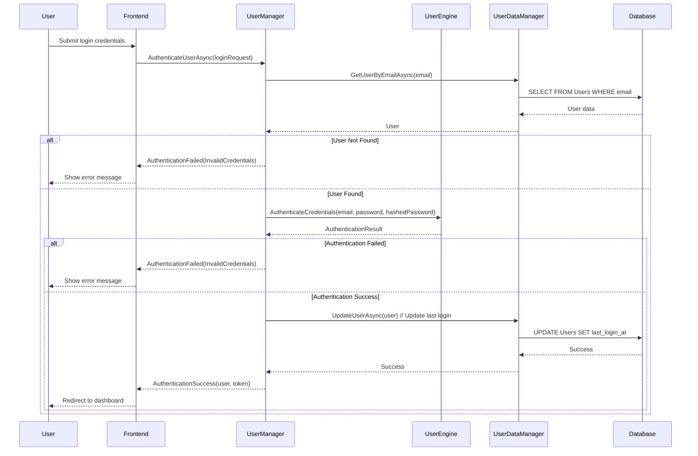
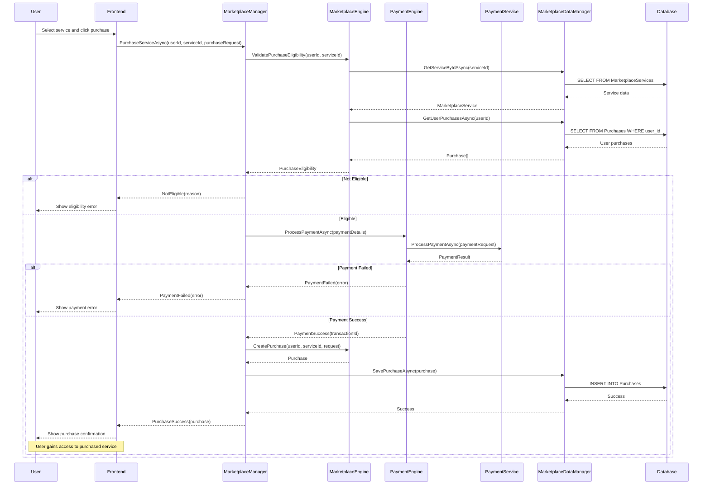
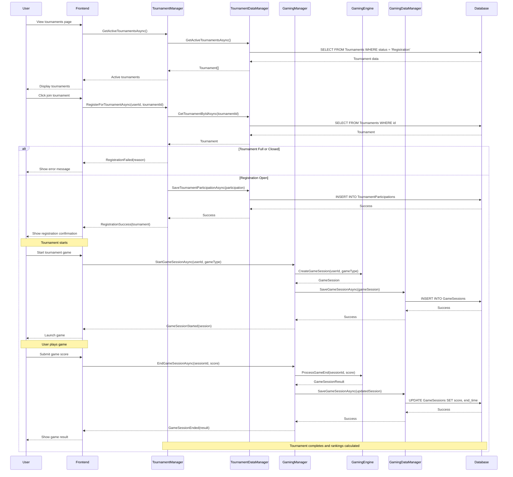
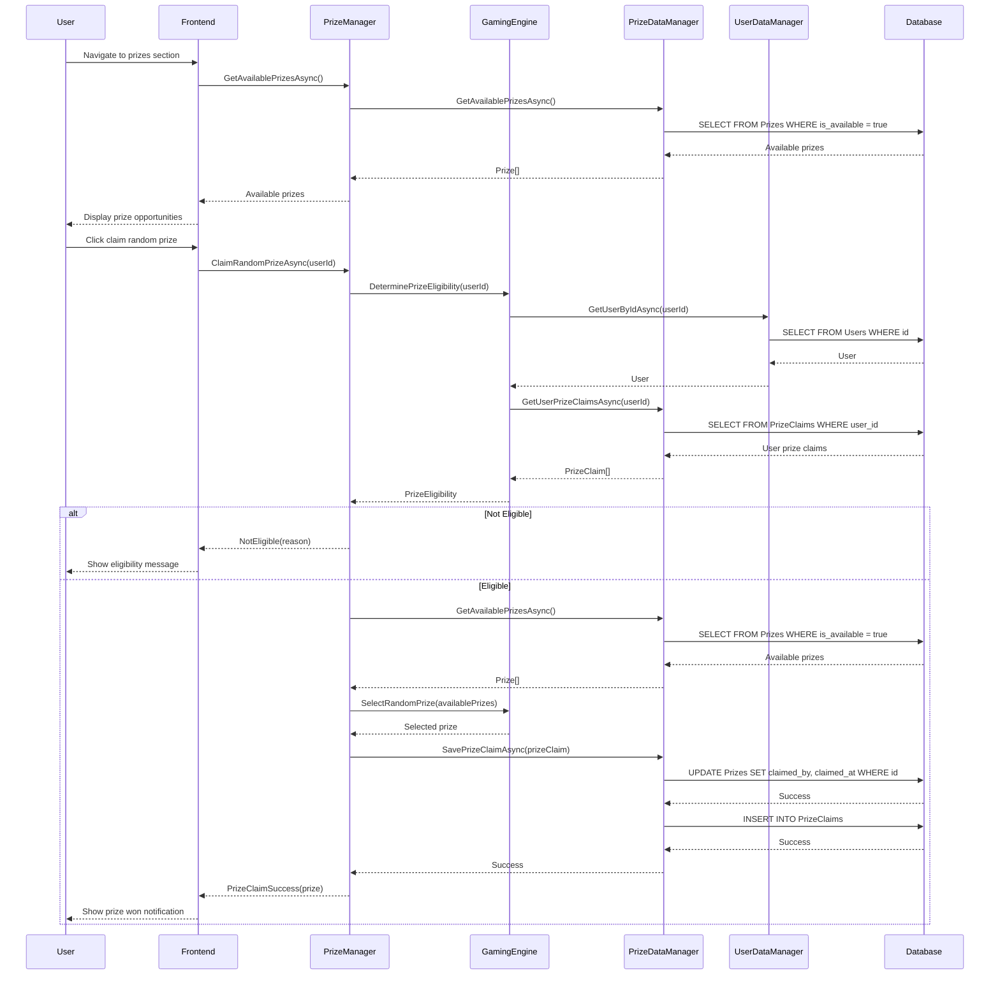
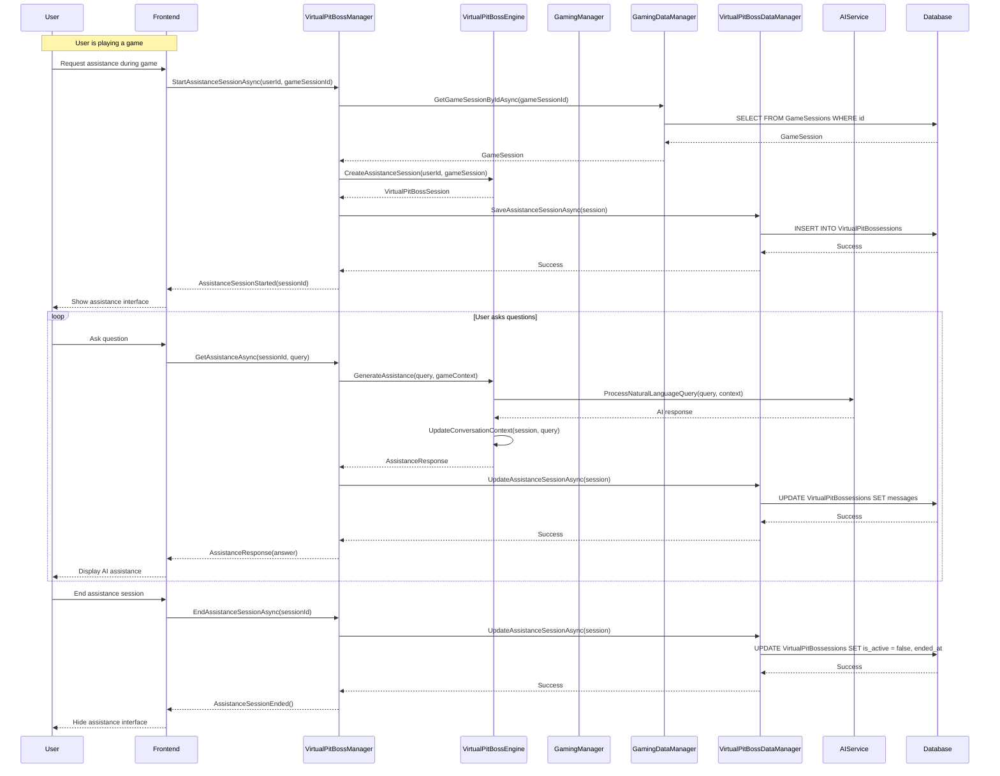
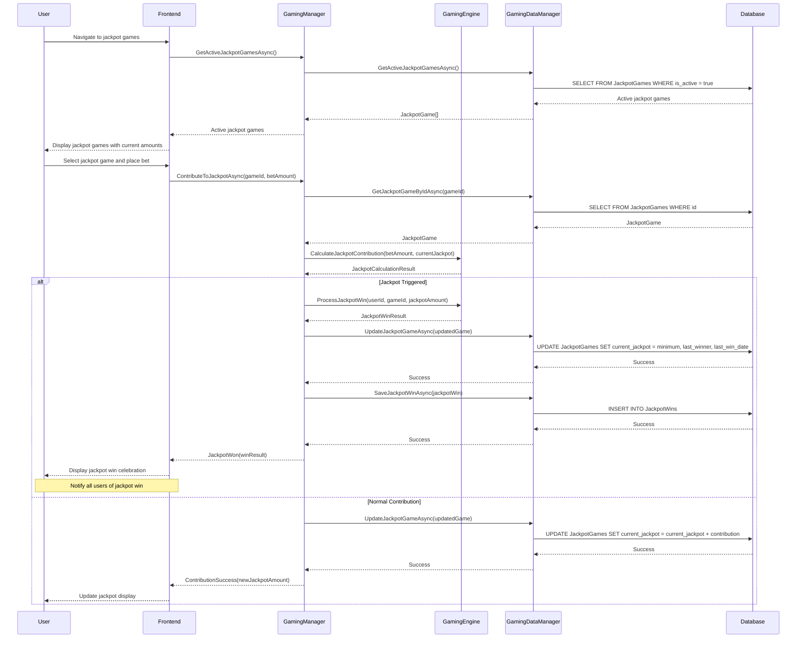
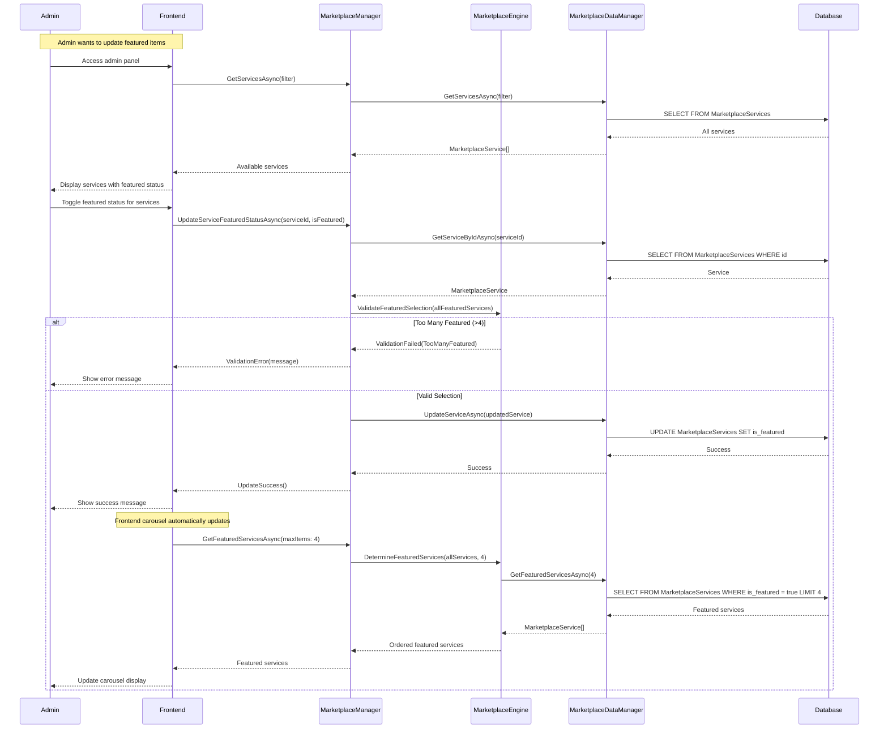
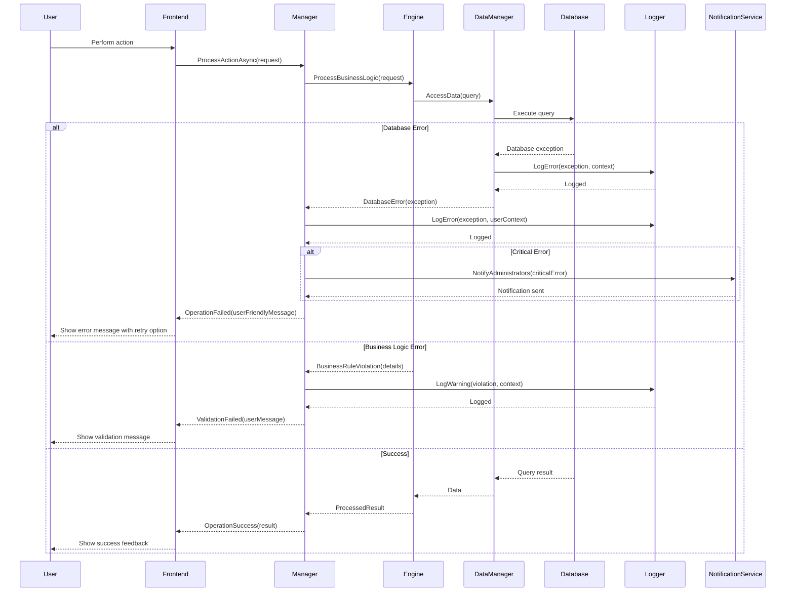
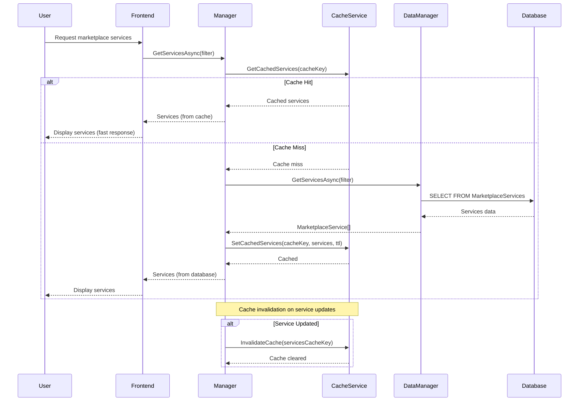

[<< Back](./../design.md)

# Sequence Diagrams - Gaming Marketplace Platform

Below we elaborate on the system's sequence diagrams showing the interaction flows for the gaming marketplace platform use cases.

We follow the iDesign principles as highlighted in the [design.md](./../design.md) file in this repository.

## User Registration and Authentication Flow

### User Registration with KYC Verification

### User Login Flow

## Marketplace Service Purchase Flow

### Service Purchase with Payment Processing

## Tournament Participation Flow

### Tournament Registration and Participation

## Random Prize Distribution Flow

### Prize Claiming Process

## Virtual Pit Boss Assistance Flow

### AI-Powered Gaming Assistance

## Jackpot Games Flow

### Progressive Jackpot Participation

## Featured Carousel Management Flow

### Dynamic Featured Content Selection

## Error Handling and Failure Recovery

### System Error Handling Flow

## Performance and Scalability Considerations

### Caching Strategy Flow

[<< Back](./../design.md)
